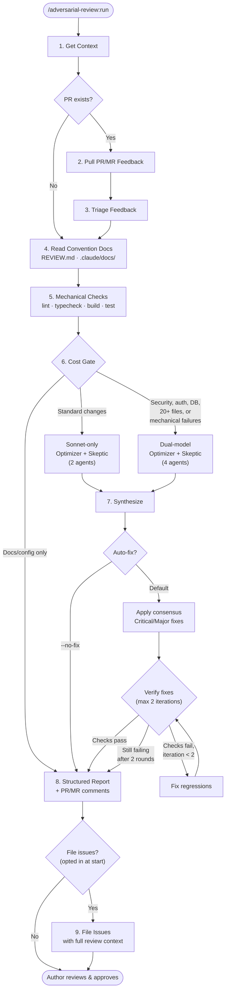
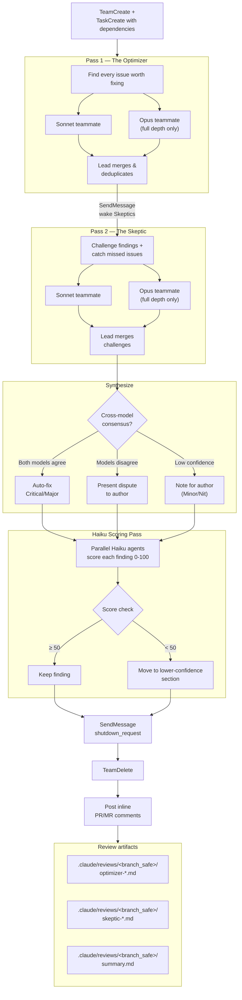

# adversarial-review

Claude Code plugin for adversarial multi-model code review.

Mechanical checks first (free), then AI agents scaled to change complexity. Two agents — **The Optimizer** and **The Skeptic** — review your code independently, challenge each other's findings, and only consensus issues get auto-fixed. A bounded verification loop catches regressions from fixes.

## Install

```
/plugin marketplace add ng/adversarial-review
```

```
/plugin install adversarial-review
```

To update to the latest version, re-run both commands.

## Usage

```
/adversarial-review:run              # auto-fix (default), auto-detect PR
/adversarial-review:run 405          # auto-fix, specific PR
/adversarial-review:run --no-fix     # review only, no code modifications
/adversarial-review:run --no-fix 405 # review only, specific PR
```

## How it works

### Pipeline overview



### Adversarial review detail (Step 6)



### Steps

0. **Parse arguments** — PR number, `--no-fix` flag (opt out of auto-fix), issue filing opt-in prompt
1. **Get context** — branch, diff, platform detection (GitHub/GitLab)
2. **Pull PR/MR feedback** — CodeRabbit, Copilot, human review comments
3. **Triage feedback** — fix now, create issue (if opted in), or dismiss
4. **Read convention docs** — `REVIEW.md`, `.claude/docs/` review lenses
5. **Mechanical checks (free)** — lint, typecheck, build, tests before any LLM spend
6. **Adversarial review** — cost-gated: standard (2 teammates) or full (4 teammates) coordinated via agent team with task dependencies
7. **Synthesize** — confidence-based filtering, Haiku scoring pass, then apply consensus fixes (auto-fix) or report as suggestions (review-only)
8. **Structured report** — findings posted as inline PR/MR comments + persistent `summary.md` artifact
9. **File issues** — if opted in: deferred, disputed, and pre-existing items filed with full review context

## Severity levels

| Marker | Severity | Meaning |
|--------|----------|---------|
| 🔴 | Critical | Bug that should be fixed before merging |
| 🟡 | Major | Significant issue, strongly recommend fixing |
| 🟢 | Minor | Worth fixing but not blocking |
| ⚪ | Nit | Stylistic or minor improvement |
| 🟣 | Pre-existing | Bug in surrounding code, not introduced by this PR |

## Review artifacts

Agent reports are saved to `.claude/reviews/<branch_safe>/` in the project (branch names are sanitized — `feat/foo` becomes `feat-foo`). The `summary.md` is the persistent artifact of record — it captures what was fixed, disputed, deferred, and any filed issue numbers. Add `.claude/reviews/` to `.gitignore` (or commit `summary.md` files separately if you want review history).

## Customizing reviews

The plugin reads guidance from multiple sources:

| File | Scope | Use for |
|------|-------|---------|
| `REVIEW.md` (repo root) | Review only | What to flag, what to skip, style rules |
| `.claude/docs/code-review.md` | Review + agents | Domain-specific review checklist with severity lenses |
| `CLAUDE.md` | All Claude Code tasks | Project conventions (also read during review) |

Without any of these, universal lenses apply (security, performance, correctness, architecture, type safety, test coverage).

## Issue filing

Issue filing is **opt-in** — the plugin asks at the start whether you want issues created for out-of-scope, pre-existing, or deferred findings. If enabled, each issue includes the full review context: problem description, Optimizer reasoning, Skeptic challenge (with confidence score), suggested fix, and source PR/MR reference. Supports both GitHub (`gh`) and GitLab (API via `$GITLAB_PAT`).

## Design rationale

This plugin's architecture is informed by research on LLM code review:

**LLMs cannot reliably self-correct through reasoning alone** ([Huang et al., 2023](https://arxiv.org/abs/2310.01798)). Forced self-correction can degrade quality — LLMs flip correct answers to incorrect at similar rates to actually fixing errors. We mitigate this by: (1) using different models across agents (Sonnet + Opus have different blind spots), (2) not forcing the Skeptic to disagree — it only challenges findings where it has substantive objections, and (3) directing the Skeptic to validate with external tools (tests, linters, type checkers) rather than pure reasoning.

**LLM static analysis can be hijacked via naming bias** ([Bernstein et al., 2025](https://arxiv.org/abs/2508.17361)). Misleading function names, comments, or docstrings can cause LLM reviewers to overlook vulnerabilities. The Optimizer includes an explicit "deception detection" lens that checks whether names and comments match actual behavior. Multi-model diversity provides a second layer of defense — different models respond differently to deceptive patterns.

**LLM code analysis is vulnerable to adversarial triggers** ([Jenko et al., 2024](https://arxiv.org/abs/2408.02509)). Subtle code patterns can manipulate LLM behavior in black-box settings. Running four independent agents (2 models x 2 roles) with cross-model consensus makes it harder for a single adversarial trigger to fool the entire pipeline.

**Progressive cost-gating and verification loops** are inspired by [Ouroboros](https://github.com/Q00/ouroboros)'s three-stage evaluation pipeline: run free mechanical checks first, only escalate to expensive LLM review when needed, and use bounded iterative verification (max 2 rounds) to catch regressions without risking infinite fix-break cycles.

## Known limitations

- A determined attacker who understands the specific models, prompts, and consensus logic could craft code that fools all four agents simultaneously. This is a defense-in-depth layer, not a security boundary.
- The Skeptic's self-correction is bounded but not eliminated — it can still flip correct Optimizer findings to incorrect (Huang et al.). Multi-model diversity reduces but does not remove this risk.
- Deception detection relies on the LLM's ability to reason about naming vs behavior, which is itself susceptible to sophisticated adversarial patterns (Bernstein et al.).
- Cost gating heuristics (20+ files, label-based triggers) are coarse. Some high-risk changes in small diffs may get standard depth when they warrant full depth.
- Human review remains essential for high-risk changes.

## Changelog

### 1.2.1 — 2026-03-28

Restructured adversarial review pipeline from background agents to agent teams.

- **Agent team orchestration**: Optimizer and Skeptic agents are now coordinated as teammates via `TeamCreate`, `TaskCreate` with explicit dependencies, and `SendMessage` for wake-up signals — replacing ad-hoc background agent spawning
- **Task dependency model**: Sequential pipeline constraints (Skeptic blocked until Optimizer merge completes) are now declarative via `addBlockedBy` rather than implicit wait-and-spawn
- **No worktree isolation**: Teammates run in the main repo (not worktrees) so they can write reports to `.claude/reviews/` without permission prompts. Containment enforced by prompt constraints ("report only, do not modify source files")
- **Branch name sanitization**: `[branch_safe]` (slashes replaced with dashes) used in team names and directory paths to handle `feat/`, `fix/` branch conventions
- **Teams API semantics documented**: Spawn section documents sequential task IDs, idle notifications, `shutdown_request` protocol, and `TeamDelete` behavior
- **Auto-fix by default**: Auto-fix now runs by default (no flag required). Use `--no-fix` to opt out and get review-only mode (no code modifications)

### 1.1.0 — 2026-03-17

Improvements informed by head-to-head comparison with Anthropic's official code-review plugin.

- **Specialized Optimizer lenses**: Added git history, code comment compliance, and prior review pattern lenses to catch regressions against intentional guards, stale comments, and reintroduced issues
- **Skeptic confidence scoring**: Each Skeptic verdict now includes a 0-100 confidence score (0=guess, 50=reasoning only, 75=tool-validated, 100=mechanically confirmed) with filtering rules that downgrade low-confidence agreements and preserve weak disagreements
- **Haiku scoring pass**: Optional post-synthesis pass launches parallel Haiku agents per finding to independently score confidence without adversarial context, catching groupthink false positives
- **Lower confidence report section**: Findings where only one model flagged it, Skeptic confidence was 50-74, or Haiku score was marginal are surfaced as "worth a second look" rather than dropped
- **Independent Skeptic assessment**: Skeptic now reads the diff and forms impressions before seeing Optimizer findings, strengthening its ability to catch false positives and find missed issues
- **GitLab support**: Platform auto-detection via `git remote -v`, with GitLab API support for MR metadata, inline discussions, issue filing, and pipeline status (via `$GITLAB_PAT` / `$GITLAB_ORG_PAT`)
- **Opt-in issue filing**: Issue creation is now prompted at the start of the review rather than at the end, giving the user control before the pipeline runs

### 1.0.0 — 2026-03-14

Initial release.

- Adversarial multi-model code review with Optimizer/Skeptic pipeline
- Progressive cost-gating: skip (docs only), standard (2 agents), full (4 agents)
- Mechanical checks (lint, typecheck, build, tests) before LLM spend
- Auto-fix mode with bounded verification loop (max 2 iterations)
- Cross-model consensus signals (Sonnet + Opus)
- GitHub PR feedback integration (CodeRabbit, Copilot, human comments)
- Deception detection lens for misleading names/comments
- Inline PR comment posting and persistent `summary.md` artifact
- Issue filing for deferred, disputed, and pre-existing items

## License

MIT
