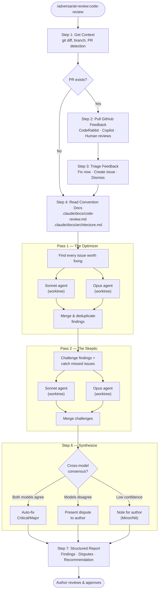

# adversarial-review

Claude Code plugin for adversarial multi-model code review.

Two AI agents — **The Optimizer** and **The Skeptic** — review your code independently across both Sonnet and Opus, then challenge each other's findings. Only consensus issues get auto-fixed; disputes are presented for your decision.

## Install

```
/plugin marketplace add ng/adversarial-review
/plugin install adversarial-review
```

## Usage

```
/adversarial-review:code-review        # review current branch
/adversarial-review:code-review 405    # review PR #405
```

## How it works



1. Pulls existing GitHub PR feedback (CodeRabbit, Copilot, human reviewers)
2. Reviews against your project's `.claude/docs/` convention files
3. Runs **The Optimizer** (Sonnet + Opus in parallel) — finds every issue worth fixing
4. Runs **The Skeptic** (Sonnet + Opus in parallel) — challenges findings, catches what was missed
5. Cross-model consensus matrix determines confidence level per finding
6. Auto-fixes high-confidence Critical/Major issues; presents disputes for author decision

## Project-specific lenses

The plugin reads `.claude/docs/code-review.md` from your repo for domain-specific review criteria. Without it, universal lenses apply (security, performance, correctness, architecture, type safety, test coverage).

## License

MIT
