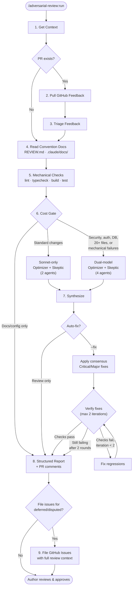
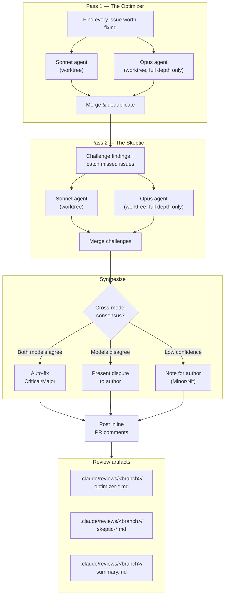

# adversarial-review

Claude Code plugin for adversarial multi-model code review.

Mechanical checks first (free), then AI agents scaled to change complexity. Two agents — **The Optimizer** and **The Skeptic** — review your code independently, challenge each other's findings, and only consensus issues get auto-fixed. A bounded verification loop catches regressions from fixes.

## Install

```
/plugin marketplace add ng/adversarial-review
/plugin install adversarial-review
```

## Usage

```
/adversarial-review:run              # review only (default)
/adversarial-review:run 405          # review specific PR
/adversarial-review:run --fix        # review + auto-fix consensus issues
/adversarial-review:run --fix 405    # auto-fix specific PR
```

## How it works

### Pipeline overview



### Adversarial review detail (Step 6)



### Steps

0. **Parse arguments** — PR number, `--fix` flag (default: review only)
1. **Get context** — branch, diff, PR detection
2. **Pull GitHub feedback** — CodeRabbit, Copilot, human review comments
3. **Triage feedback** — fix now, create issue, or dismiss
4. **Read convention docs** — `REVIEW.md`, `.claude/docs/` review lenses
5. **Mechanical checks (free)** — lint, typecheck, build, tests before any LLM spend
6. **Adversarial review** — cost-gated: standard (2 agents) or full (4 agents) based on change risk
7. **Synthesize** — in auto-fix mode: apply consensus fixes + bounded verification loop (max 2 iterations). In review-only mode: report findings as suggestions.
8. **Structured report** — findings posted as inline PR comments + persistent `summary.md` artifact
9. **File issues** — deferred, disputed, and pre-existing items filed as GitHub issues with full review context

## Severity levels

| Marker | Severity | Meaning |
|--------|----------|---------|
| 🔴 | Critical | Bug that should be fixed before merging |
| 🟡 | Major | Significant issue, strongly recommend fixing |
| 🟢 | Minor | Worth fixing but not blocking |
| ⚪ | Nit | Stylistic or minor improvement |
| 🟣 | Pre-existing | Bug in surrounding code, not introduced by this PR |

## Review artifacts

Agent reports are saved to `.claude/reviews/<branch>/` in the project. The `summary.md` is the persistent artifact of record — it captures what was fixed, disputed, deferred, and any filed issue numbers. Add `.claude/reviews/` to `.gitignore` (or commit `summary.md` files separately if you want review history).

## Customizing reviews

The plugin reads guidance from multiple sources:

| File | Scope | Use for |
|------|-------|---------|
| `REVIEW.md` (repo root) | Review only | What to flag, what to skip, style rules |
| `.claude/docs/code-review.md` | Review + agents | Domain-specific review checklist with severity lenses |
| `CLAUDE.md` | All Claude Code tasks | Project conventions (also read during review) |

Without any of these, universal lenses apply (security, performance, correctness, architecture, type safety, test coverage).

## Issue filing

After the review, the plugin offers to file GitHub issues for deferred, disputed, and pre-existing items. Each issue includes the full review context: problem description, Optimizer reasoning, Skeptic challenge, suggested fix, and source PR reference. This preserves the debate so the team can pick up where the review left off without re-discovering the same issues.

## Design rationale

This plugin's architecture is informed by research on LLM code review:

**LLMs cannot reliably self-correct through reasoning alone** ([Huang et al., 2023](https://arxiv.org/abs/2310.01798)). Forced self-correction can degrade quality — LLMs flip correct answers to incorrect at similar rates to actually fixing errors. We mitigate this by: (1) using different models across agents (Sonnet + Opus have different blind spots), (2) not forcing the Skeptic to disagree — it only challenges findings where it has substantive objections, and (3) directing the Skeptic to validate with external tools (tests, linters, type checkers) rather than pure reasoning.

**LLM static analysis can be hijacked via naming bias** ([Bernstein et al., 2025](https://arxiv.org/abs/2508.17361)). Misleading function names, comments, or docstrings can cause LLM reviewers to overlook vulnerabilities. The Optimizer includes an explicit "deception detection" lens that checks whether names and comments match actual behavior. Multi-model diversity provides a second layer of defense — different models respond differently to deceptive patterns.

**LLM code analysis is vulnerable to adversarial triggers** ([Jenko et al., 2024](https://arxiv.org/abs/2408.02509)). Subtle code patterns can manipulate LLM behavior in black-box settings. Running four independent agents (2 models x 2 roles) with cross-model consensus makes it harder for a single adversarial trigger to fool the entire pipeline.

**Progressive cost-gating and verification loops** are inspired by [Ouroboros](https://github.com/Q00/ouroboros)'s three-stage evaluation pipeline: run free mechanical checks first, only escalate to expensive LLM review when needed, and use bounded iterative verification (max 2 rounds) to catch regressions without risking infinite fix-break cycles.

## Known limitations

- A determined attacker who understands the specific models, prompts, and consensus logic could craft code that fools all four agents simultaneously. This is a defense-in-depth layer, not a security boundary.
- The Skeptic's self-correction is bounded but not eliminated — it can still flip correct Optimizer findings to incorrect (Huang et al.). Multi-model diversity reduces but does not remove this risk.
- Deception detection relies on the LLM's ability to reason about naming vs behavior, which is itself susceptible to sophisticated adversarial patterns (Bernstein et al.).
- Cost gating heuristics (20+ files, label-based triggers) are coarse. Some high-risk changes in small diffs may get standard depth when they warrant full depth.
- Human review remains essential for high-risk changes.

## License

MIT
