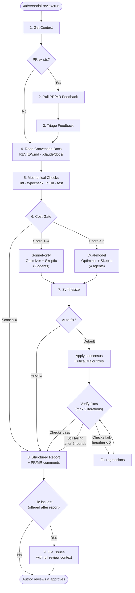
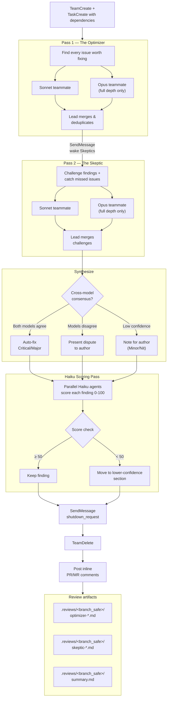

# adversarial-review


Claude Code plugin for adversarial multi-model code review.

Mechanical checks first (free), then AI agents scaled to change complexity. Two agents — **The Optimizer** and **The Skeptic** — review your code independently, challenge each other's findings, and only consensus issues get auto-fixed. A bounded verification loop catches regressions from fixes.

## Install

```
/plugin marketplace add ng/adversarial-review
```

```
/plugin install adversarial-review
```

To update to the latest version, re-run both commands.

## Usage

```
/adversarial-review:run              # auto-fix (default), auto-detect PR
/adversarial-review:run 405          # auto-fix, specific PR
/adversarial-review:run --no-fix     # review only, no code modifications
/adversarial-review:run --no-fix 405 # review only, specific PR
```

## GitHub Action

Use as a GitHub Action to run adversarial reviews automatically on PRs:

```yaml
name: Adversarial Code Review

on:
  pull_request:
    types: [opened, ready_for_review, reopened, labeled]

jobs:
  review:
    if: >-
      github.event.action != 'labeled' ||
      github.event.label.name == 'review'
    runs-on: ubuntu-latest
    permissions:
      contents: write
      pull-requests: write
      issues: write
      id-token: write
    steps:
      - uses: actions/checkout@v4
        with:
          fetch-depth: 0
      - uses: ng/adversarial-review@v1
        with:
          claude_code_oauth_token: ${{ secrets.CLAUDE_CODE_OAUTH_TOKEN }}
```

### Inputs

| Input | Required | Default | Description |
|-------|----------|---------|-------------|
| `claude_code_oauth_token` | Yes | — | Claude Code OAuth token |
| `pr_number` | No | Triggering PR | PR number to review |
| `mode` | No | `auto-fix` | `auto-fix` or `no-fix` (report only) |
| `allowed_tools` | No | — | Additional allowed tools (comma-separated) |
| `model` | No | — | Model override for lead agent |

### Recommended triggers

Avoid `synchronize` (fires on every push) — the review is slow and expensive. Use `labeled` with a `review` label for re-runs after pushing fixes.

## How it works

### Pipeline overview


```mermaid
flowchart TD
    Start(["/adversarial-review:run"]) --> Context["1. Get Context"]
    Context --> PR{PR exists?}
    PR -->|Yes| Feedback["2. Pull PR/MR Feedback"]
    PR -->|No| Docs
    Feedback --> Triage["3. Triage Feedback"]
    Triage --> Docs["4. Read Convention Docs<br/>REVIEW.md · .claude/docs/"]
    Docs --> Mechanical["5. Mechanical Checks<br/>lint · typecheck · build · test"]
    Mechanical --> Gate{"6. Cost Gate"}
    Gate -->|"Score ≤ 0"| Report
    Gate -->|"Score 1–4"| Standard["Sonnet-only<br/>Optimizer + Skeptic<br/>(2 agents)"]
    Gate -->|"Score ≥ 5"| Full["Dual-model<br/>Optimizer + Skeptic<br/>(4 agents)"]
    Standard & Full --> Synth["7. Synthesize"]
    Synth --> ModeCheck{Auto-fix?}
    ModeCheck -->|"--no-fix"| Report
    ModeCheck -->|"Default"| Apply["Apply consensus<br/>Critical/Major fixes"]
    Apply --> Verify{"Verify fixes<br/>(max 2 iterations)"}
    Verify -->|"Checks pass"| Report
    Verify -->|"Checks fail,<br/>iteration < 2"| Fix["Fix regressions"] --> Verify
    Verify -->|"Still failing<br/>after 2 rounds"| Report
    Report["8. Structured Report<br/>+ PR/MR comments"] --> Issues{"File issues?<br/>(offered after report)"}
    Issues -->|Yes| File["9. File Issues<br/>with full review context"]
    Issues -->|No| Done
    File --> Done([Author reviews & approves])
```

### Adversarial review detail (Step 6)


```mermaid
flowchart TD
    Team["TeamCreate +<br/>TaskCreate with dependencies"] --> Pass1

    subgraph Pass1["Pass 1 — The Optimizer"]
        Optimizer["Find every issue worth fixing"]
        OptSonnet["Sonnet teammate"]
        OptOpus["Opus teammate<br/>(full depth only)"]
        MergeOpt["Lead merges &<br/>deduplicates"]
        Optimizer --> OptSonnet & OptOpus
        OptSonnet & OptOpus --> MergeOpt
    end

    MergeOpt -->|"SendMessage<br/>wake Skeptics"| Skeptic

    subgraph Pass2["Pass 2 — The Skeptic"]
        Skeptic["Challenge findings +<br/>catch missed issues"]
        SkpSonnet["Sonnet teammate"]
        SkpOpus["Opus teammate<br/>(full depth only)"]
        MergeSkp["Lead merges<br/>challenges"]
        Skeptic --> SkpSonnet & SkpOpus
        SkpSonnet & SkpOpus --> MergeSkp
    end

    MergeSkp --> Confidence

    subgraph Synthesis["Synthesize"]
        Confidence{"Cross-model<br/>consensus?"}
        AutoFix["Auto-fix<br/>Critical/Major"]
        Dispute["Present dispute<br/>to author"]
        Note["Note for author<br/>(Minor/Nit)"]
        Confidence -->|"Both models agree"| AutoFix
        Confidence -->|"Models disagree"| Dispute
        Confidence -->|"Low confidence"| Note
    end

    AutoFix & Dispute & Note --> Haiku

    subgraph HaikuPass["Haiku Scoring Pass"]
        Haiku["Parallel Haiku agents<br/>score each finding 0-100"]
        Filter{"Score check"}
        Keep["Keep finding"]
        Downgrade["Move to lower-confidence<br/>section"]
        Haiku --> Filter
        Filter -->|"≥ 50"| Keep
        Filter -->|"< 50"| Downgrade
    end

    Keep & Downgrade --> ShutdownReq["SendMessage<br/>shutdown_request"]
    ShutdownReq --> Shutdown["TeamDelete"]
    Shutdown --> PR["Post inline<br/>PR/MR comments"]
    PR --> Artifacts

    subgraph Artifacts["Review artifacts"]
        direction LR
        A1[".reviews/&lt;branch_safe&gt;/<br/>optimizer-*.md"]
        A2[".reviews/&lt;branch_safe&gt;/<br/>skeptic-*.md"]
        A3[".reviews/&lt;branch_safe&gt;/<br/>summary.md"]
    end
```

### Steps

0. **Parse arguments** — PR number, `--no-fix` flag (opt out of auto-fix)
1. **Get context** — branch, diff, platform detection (GitHub/GitLab)
2. **Pull PR/MR feedback** — CodeRabbit, Copilot, human review comments
3. **Triage feedback** — fix now, note for report, or dismiss
4. **Read convention docs** — `REVIEW.md`, `.claude/docs/` review lenses
5. **Mechanical checks (free)** — lint, typecheck, build, tests before any LLM spend
6. **Adversarial review** — change-type classification, weighted escalation scoring, then standard (2 teammates) or full (4 teammates) coordinated via agent team with task dependencies
7. **Synthesize** — confidence-based filtering, Haiku scoring pass, then apply consensus fixes (auto-fix) or report as suggestions (review-only)
8. **Structured report** — findings posted as inline PR/MR comments + persistent `summary.md` artifact
9. **File issues** — offered after report: deferred, disputed, and pre-existing items filed with full review context

## Severity levels

| Marker | Severity | Meaning |
|--------|----------|---------|
| 🔴 | Critical | Bug that should be fixed before merging |
| 🟡 | Major | Significant issue, strongly recommend fixing |
| 🟢 | Minor | Worth fixing but not blocking |
| ⚪ | Nit | Stylistic or minor improvement |
| 🟣 | Pre-existing | Bug in surrounding code, not introduced by this PR |

## Review artifacts

Agent reports are saved to `.reviews/<branch_safe>/` in the project (branch names are sanitized — `feat/foo` becomes `feat-foo`). The `summary.md` is the persistent artifact of record — it captures what was fixed, disputed, deferred, and any filed issue numbers. Add `.reviews/` to `.gitignore` (or commit `summary.md` files separately if you want review history).

## Customizing reviews

The plugin reads guidance from multiple sources:

| File | Scope | Use for |
|------|-------|---------|
| `REVIEW.md` (repo root) | Review only | What to flag, what to skip, style rules |
| `.claude/docs/code-review.md` | Review + agents | Domain-specific review checklist with severity lenses |
| `CLAUDE.md` | All Claude Code tasks | Project conventions (also read during review) |

Without any of these, universal lenses apply (security, performance, correctness, architecture, type safety, test coverage).

## Issue filing

Issue filing is **offered after the review completes** — the plugin runs the full review uninterrupted, then asks if you want issues created for deferred, disputed, and pre-existing findings. Each issue includes the full review context: problem description, Optimizer reasoning, Skeptic challenge (with confidence score), suggested fix, and source PR/MR reference. Supports both GitHub (`gh`) and GitLab (API via `$GITLAB_PAT`).

## Design rationale

This plugin's architecture is informed by research on LLM code review and first-principles patterns from Claude Code's own agent orchestration internals.

### Research foundations

**LLMs cannot reliably self-correct through reasoning alone** ([Huang et al., 2023](https://arxiv.org/abs/2310.01798)). Forced self-correction can degrade quality — LLMs flip correct answers to incorrect at similar rates to actually fixing errors. We mitigate this by: (1) using different models across agents (Sonnet + Opus have different blind spots), (2) not forcing the Skeptic to disagree — it only challenges findings where it has substantive objections, and (3) directing the Skeptic to validate with external tools (tests, linters, type checkers) rather than pure reasoning.

**LLM static analysis can be hijacked via naming bias** ([Bernstein et al., 2025](https://arxiv.org/abs/2508.17361)). Misleading function names, comments, or docstrings can cause LLM reviewers to overlook vulnerabilities. The Optimizer includes an explicit "deception detection" lens that checks whether names and comments match actual behavior. Multi-model diversity provides a second layer of defense — different models respond differently to deceptive patterns.

**LLM code analysis is vulnerable to adversarial triggers** ([Jenko et al., 2024](https://arxiv.org/abs/2408.02509)). Subtle code patterns can manipulate LLM behavior in black-box settings. Running four independent agents (2 models x 2 roles) with cross-model consensus makes it harder for a single adversarial trigger to fool the entire pipeline.

**Progressive cost-gating and verification loops** are inspired by [Ouroboros](https://github.com/Q00/ouroboros)'s three-stage evaluation pipeline: run free mechanical checks first, only escalate to expensive LLM review when needed, and use bounded iterative verification (max 2 rounds) to catch regressions without risking infinite fix-break cycles.

### Learned from Claude Code internals

Several patterns in this plugin were directly informed by studying Claude Code's own agent architecture (via the [March 2026 source map disclosure](https://github.com/anthropics/claude-code/issues/1956)):

**Anti-rationalization guards** — Claude Code's built-in verification agent explicitly lists its own failure modes in its prompt: "You have two documented failure patterns. First, verification avoidance... Second, being seduced by the first 80%." It also enumerates specific rationalizations that don't count as validation ("The code looks correct based on my reading"). We adopted this pattern for The Skeptic — explicitly naming rubber-stamping and lazy disagreement as failure modes, listing invalid verdict bases, and requiring tool-output evidence for every Agree/Disagree verdict.

**Evidence-gated verdicts** — Claude Code's verification agent requires a `Command run` block with actual output for every PASS verdict. "A check without a Command run block is not a PASS." We applied this as the mandatory `Evidence` field in Skeptic verdicts — no evidence means the verdict is a guess, labeled accordingly. This forces the Skeptic to actually run tests, grep patterns, and check types rather than reasoning about whether the Optimizer was right.

**Change-type strategy matrices** — Claude Code's verification agent uses different verification strategies depending on change type (frontend, backend, CLI, infra, library, bug fix, DB migrations, refactoring). We adopted this as the change-type classification step: every changed file is mapped to a type (auth, database, crypto, api, frontend, infra, etc.) with type-specific priority checks. An auth change gets privilege-escalation and IDOR checks; a database change gets migration-reversibility and N+1 checks; a frontend change gets ARIA and keyboard-nav checks.

**Coordinator-only synthesis** — Claude Code's Coordinator Mode restricts the coordinator to only 4 tools (Agent, TaskStop, SendMessage, SyntheticOutput) while workers get the full toolset. This prevents the coordinator from accidentally modifying files during synthesis. We adopted this as explicit read-only constraints during Step 7: the lead can only read reports and write to `.reviews/` during synthesis, with source modifications restricted to the explicit "Apply agreed fixes" sub-step.

**Numeric output anchors** — Claude Code's internal prompts use specific word-count limits ("Keep text between tool calls to ≤25 words") which showed measurable token reduction in A/B testing. We applied this to both agent prompts: Optimizer findings ≤50 words per Problem field, suggested fixes ≤30 words, Skeptic challenges ≤50 words. This reduces verbose reasoning that inflates cost without improving signal.

**Fix quality anti-patterns** — Claude Code's system prompt explicitly tells the model "Three similar lines of code is better than a premature abstraction" and "Don't add features, refactor code, or make 'improvements' beyond what was asked." We added these as Fix Quality Guardrails in the Optimizer prompt — preventing suggested fixes from over-engineering the solution with unnecessary abstractions, feature flags, or adjacent refactoring.

## Known limitations

- A determined attacker who understands the specific models, prompts, and consensus logic could craft code that fools all four agents simultaneously. This is a defense-in-depth layer, not a security boundary.
- The Skeptic's self-correction is bounded but not eliminated — it can still flip correct Optimizer findings to incorrect (Huang et al.). Multi-model diversity reduces but does not remove this risk.
- Deception detection relies on the LLM's ability to reason about naming vs behavior, which is itself susceptible to sophisticated adversarial patterns (Bernstein et al.).
- Weighted escalation scoring improves on coarse heuristics but remains an approximation — some high-risk patterns in low-scoring diffs may still get standard depth. Projects can fine-tune via `.claude/docs/code-review.md` critical lenses.
- Human review remains essential for high-risk changes.

## Changelog

### 1.3.0 — 2026-04-01

Improvements informed by first-principles patterns from Claude Code's agent orchestration internals.

- **Anti-rationalization guards**: Skeptic prompt now explicitly names its failure modes (rubber-stamping, lazy disagreement), lists invalid verdict bases, and requires tool-output evidence for every Agree/Disagree verdict. New 🚫 Cannot verify verdict (confidence capped at 40) for when tools can't validate
- **Change-type classification**: Every changed file is mapped to a type (auth, database, crypto, api, frontend, infra, config, test, docs, types) with type-specific priority checks and activated lenses — agents focus on what matters for this specific PR instead of applying all lenses uniformly
- **Weighted escalation scoring**: Replaced binary "any trigger fires → full depth" with a point-based system. High-risk domains (auth/crypto/db) score +3, medium-risk (api/infra) +2, with de-escalation (-10) for pure docs/config/test changes. Score breakdown logged in report for auditability
- **Coordinator-only synthesis**: Lead operates in read-only mode during synthesis — source modifications restricted to the explicit "Apply agreed fixes" sub-step, preventing accidental edits during analysis
- **Prompt engineering**: Numeric word-count anchors (findings ≤50 words, fixes ≤30 words) reduce verbose reasoning. Fix Quality Guardrails prevent over-engineered suggestions (no premature abstractions, no feature flags for direct fixes, minimum viable change only)

### 1.2.2 — 2026-03-28

- **Review artifacts moved**: `.claude/reviews/` → `.reviews/` — the `.claude/` directory is protected by Claude Code (settings/hooks/config), causing permission prompts even with `bypassPermissions`

### 1.2.1 — 2026-03-28

Restructured adversarial review pipeline from background agents to agent teams.

- **Agent team orchestration**: Optimizer and Skeptic agents are now coordinated as teammates via `TeamCreate`, `TaskCreate` with explicit dependencies, and `SendMessage` for wake-up signals — replacing ad-hoc background agent spawning
- **Task dependency model**: Sequential pipeline constraints (Skeptic blocked until Optimizer merge completes) are now declarative via `addBlockedBy` rather than implicit wait-and-spawn
- **No worktree isolation**: Teammates run in the main repo (not worktrees) so they can write reports to `.reviews/` without permission prompts. Containment enforced by prompt constraints ("report only, do not modify source files")
- **Branch name sanitization**: `[branch_safe]` (slashes replaced with dashes) used in team names and directory paths to handle `feat/`, `fix/` branch conventions
- **Teams API semantics documented**: Spawn section documents sequential task IDs, idle notifications, `shutdown_request` protocol, and `TeamDelete` behavior
- **Auto-fix by default**: Auto-fix now runs by default (no flag required). Use `--no-fix` to opt out and get review-only mode (no code modifications)

### 1.1.0 — 2026-03-17

Improvements informed by head-to-head comparison with Anthropic's official code-review plugin.

- **Specialized Optimizer lenses**: Added git history, code comment compliance, and prior review pattern lenses to catch regressions against intentional guards, stale comments, and reintroduced issues
- **Skeptic confidence scoring**: Each Skeptic verdict now includes a 0-100 confidence score (0=guess, 50=reasoning only, 75=tool-validated, 100=mechanically confirmed) with filtering rules that downgrade low-confidence agreements and preserve weak disagreements
- **Haiku scoring pass**: Optional post-synthesis pass launches parallel Haiku agents per finding to independently score confidence without adversarial context, catching groupthink false positives
- **Lower confidence report section**: Findings where only one model flagged it, Skeptic confidence was 50-74, or Haiku score was marginal are surfaced as "worth a second look" rather than dropped
- **Independent Skeptic assessment**: Skeptic now reads the diff and forms impressions before seeing Optimizer findings, strengthening its ability to catch false positives and find missed issues
- **GitLab support**: Platform auto-detection via `git remote -v`, with GitLab API support for MR metadata, inline discussions, issue filing, and pipeline status (via `$GITLAB_PAT` / `$GITLAB_ORG_PAT`)
- **Post-review issue filing**: Issue creation offered after the review completes rather than blocking at the start

### 1.0.0 — 2026-03-14

Initial release.

- Adversarial multi-model code review with Optimizer/Skeptic pipeline
- Progressive cost-gating: skip (docs only), standard (2 agents), full (4 agents)
- Mechanical checks (lint, typecheck, build, tests) before LLM spend
- Auto-fix mode with bounded verification loop (max 2 iterations)
- Cross-model consensus signals (Sonnet + Opus)
- GitHub PR feedback integration (CodeRabbit, Copilot, human comments)
- Deception detection lens for misleading names/comments
- Inline PR comment posting and persistent `summary.md` artifact
- Issue filing for deferred, disputed, and pre-existing items

## License

MIT
