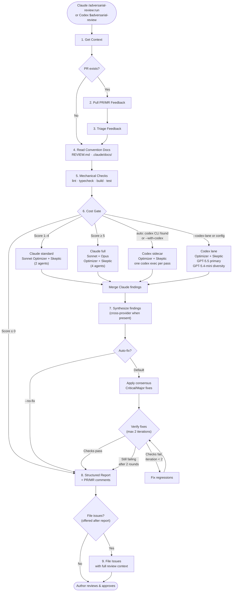
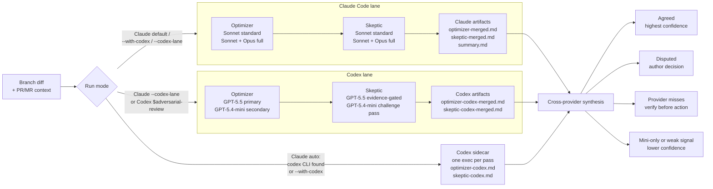
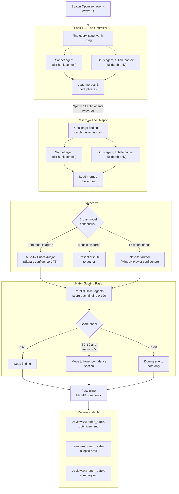

# adversarial-review


Claude Code and Codex plugin for adversarial multi-model code review.

Mechanical checks first (free), then AI agents scaled to change complexity. Two agents — **The Optimizer** and **The Skeptic** — review your code independently, challenge each other's findings, and only consensus issues get auto-fixed. A bounded verification loop catches regressions from fixes.

## Install

### Claude Code

```
/plugin marketplace add ng/adversarial-review
```

```
/plugin install adversarial-review
```

To update to the latest version, re-run both commands.

### Codex

Codex support is packaged through `.codex-plugin/plugin.json` and the `$adversarial-review` skill.

Requires Codex CLI **v0.142.0 or newer** — earlier versions reject the repo-root marketplace path (`"path": "./"`) with `local plugin source path must not be empty` ([openai/codex#17066](https://github.com/openai/codex/issues/17066), fixed in [openai/codex#28771](https://github.com/openai/codex/pull/28771)).

```
codex plugin marketplace add ng/adversarial-review
```

```
codex plugin add adversarial-review@adversarial-review
```

## Usage

### Claude Code

```
/adversarial-review:run              # auto-fix (default), auto-detect PR
/adversarial-review:run 405          # auto-fix, specific PR
/adversarial-review:run --no-fix     # review only, no code modifications
/adversarial-review:run --no-fix 405 # review only, specific PR
/adversarial-review:run --with-codex # add OpenAI Codex as a cross-vendor sidecar reviewer
/adversarial-review:run --codex-lane # run the full Codex-native review lane alongside Claude
```

#### Cross-vendor diversity (`--with-codex`, `--codex-lane`)

An all-Claude reviewer pool (Sonnet + Opus) shares blind spots. Two tiers add OpenAI Codex as a
cross-vendor reviewer. A finding both vendors independently flag is almost certainly real; a
finding only Codex raises is blind-spot coverage one vendor can't give you.

- **`--with-codex` — sidecar.** One background `codex exec` call per pass, using the Claude
  review prompts adapted for Codex. It writes the same report files the merge step reads
  (`optimizer-codex.md`, `skeptic-codex.md`), so it's a first-class reviewer. Runs in a
  `read-only` sandbox, which structurally enforces the report-only constraint. Cheap.
- **`--codex-lane` — full Codex lane.** Each pass is delegated to the Codex-native workflow in
  `skills/codex-review/SKILL.md` — the same lane `$adversarial-review` runs inside Codex. Codex
  orchestrates its own subagents (GPT-5.5 primary + GPT-5.4-mini diversity at full depth) with
  its own prompts and trust model, and writes merged lane artifacts (`optimizer-codex-merged.md`,
  `skeptic-codex-merged.md`) that feed the same cross-provider synthesis. The lane's Skeptic
  phase reads the Claude lane's `optimizer-merged.md` as `--compare-claude` input, so every
  Claude finding gets a genuinely cross-vendor challenge. Needs a `workspace-write` sandbox to
  write its artifacts; containment falls back to prompt contract, a gitignored `.reviews/`, and
  a baseline-aware tracked-file guard (pre-phase snapshot, then revert only what the lane newly
  dirtied — pre-existing uncommitted work is never touched). Costs more.

**The sidecar is the default when available**: if the
[`codex` CLI](https://github.com/openai/codex) is installed and authenticated via `codex login`
(ChatGPT SSO — no API key needed), a Claude run adds the sidecar automatically — no flag needed.
The lane is opt-in because it costs meaningfully more. If Codex is unavailable the review
proceeds Claude-only with a note; Codex can only add coverage, never block a review.
Local CLI only for now — the GitHub Action runs Claude-only.

To change your default, set it once in `~/.claude/adversarial-review.json` (user-wide) or
`.claude/adversarial-review.json` (per repo) instead of passing flags per run:

```json
{ "codex-lane": true }
```

to default the full lane on, or `{ "with-codex": false }` to opt out of the auto-detected
sidecar. Explicit flags always win — `--no-codex` forces a Claude-only run, `--with-codex` /
`--codex-lane` force Codex on. See "Customizing reviews" for the full config reference.

### Codex

```
$adversarial-review                  # auto-fix (default), auto-detect PR
$adversarial-review 405              # auto-fix, specific PR
$adversarial-review --no-fix         # review only, no code modifications
$adversarial-review --compare-claude # compare Codex findings with Claude artifacts
```

Codex is not a literal `model: "codex"` drop-in for the Claude Code `Agent` tool. For cross-provider review from a Claude run, pass `--with-codex` (Codex joins as a read-only `codex exec` sidecar) or `--codex-lane` (the Claude run drives this full Codex-native lane headlessly, subagents and all); either way the Codex reports merge into the same synthesis. Alternatively, run Claude and Codex as fully separate reviewer lanes that write comparable `.reviews/<branch_safe>/` artifacts, then synthesize agreement and disagreement.

## GitHub Action

### Claude Code Action

Use as a GitHub Action to run adversarial reviews automatically on PRs:

```yaml
name: Adversarial Code Review

on:
  pull_request:
    types: [opened, ready_for_review, reopened, labeled]

jobs:
  review:
    if: >-
      github.event.action != 'labeled' ||
      github.event.label.name == 'review'
    runs-on: ubuntu-latest
    permissions:
      contents: write
      pull-requests: write
      issues: write
      id-token: write
    steps:
      - uses: actions/checkout@v4
        with:
          fetch-depth: 0
      - uses: ng/adversarial-review@v1
        with:
          claude_code_oauth_token: ${{ secrets.CLAUDE_CODE_OAUTH_TOKEN }}
```

### Inputs

| Input | Required | Default | Description |
|-------|----------|---------|-------------|
| `claude_code_oauth_token` | Yes | — | Claude Code OAuth token |
| `pr_number` | No | Triggering PR | PR number to review |
| `mode` | No | `no-fix` | `no-fix` (report only) or `auto-fix`. Unrecognized values fall back to `no-fix` (fail-safe) |
| `allowed_tools` | No | — | Additional allowed tools (comma-separated) |
| `model` | No | — | Model override for lead agent |

### Codex Action

Use `openai/codex-action@v1` when you want an independent Codex review lane in CI. This example reads the Codex workflow instructions from the checked-out repo, so it does not require installing the plugin in the runner first.

```yaml
name: Codex Adversarial Review

on:
  pull_request:
    types: [opened, ready_for_review, reopened, labeled]

jobs:
  codex-review:
    if: >-
      github.event.action != 'labeled' ||
      github.event.label.name == 'review'
    runs-on: ubuntu-latest
    permissions:
      contents: read
      pull-requests: write
      issues: write
    steps:
      - uses: actions/checkout@v5
        with:
          ref: refs/pull/${{ github.event.pull_request.number }}/merge
          fetch-depth: 0
      - uses: openai/codex-action@v1
        with:
          openai-api-key: ${{ secrets.OPENAI_API_KEY }}
          prompt: "Read skills/codex-review/SKILL.md, then run that workflow in --no-fix mode for PR ${{ github.event.pull_request.number }}."
          # workspace-write: the skill writes .reviews/ artifacts and mechanical.txt;
          # a read-only sandbox would fail the run. Job permissions stay contents: read.
          sandbox: workspace-write
```

For cross-provider review in CI, run the Claude job and the Codex job as separate jobs and upload `.reviews/` as artifacts from each lane before a synthesis step.

## Release automation

Releases are managed by release-please. A `feat:` or `fix:` commit on `main` opens or updates a release PR; once that PR merges, release-please creates the GitHub release and the workflow moves the floating `v1` tag.

To let release PRs run required checks and auto-merge, configure a GitHub App token for each repository that uses this workflow:

1. Create a GitHub App, such as `release-please-automerge-bot`.
2. Grant repository permissions: **Contents: Read and write**, **Issues: Read and write**, **Pull requests: Read and write**, and **Metadata: Read-only**.
3. Generate a private key for the app.
4. Install the app on the repository, or on all repositories that should use release auto-merge.
5. Add repository or organization variable `RELEASE_APP_ID` with the app id.
6. Add repository or organization secret `RELEASE_APP_PRIVATE_KEY` with the full PEM private key.
7. Enable repository auto-merge in GitHub settings, or run `gh api -X PATCH repos/OWNER/REPO -f allow_auto_merge=true`.

Without those settings, the workflow falls back to `GITHUB_TOKEN`. That can create the release PR, but GitHub suppresses follow-on workflow runs from bot-created events, so branch protection may leave the release PR waiting for a manual merge.

### Recommended triggers

Avoid `synchronize` (fires on every push) — the review is slow and expensive. Use `labeled` with a `review` label for re-runs after pushing fixes.

### Fork PRs and prompt injection

Fork PRs don't receive repository secrets by default, so the review job won't run on them under `pull_request`. Be deliberate with the label-gated re-run path, though: applying the `review` label to a fork PR runs the full pipeline — with `contents: write` and `issues: write` — over attacker-authored code and comments. The agent prompts treat the diff and PR content as data rather than instructions, but that is a mitigation, not a security boundary; read a fork's diff before labeling it.

## How it works

### Pipeline overview


```mermaid
flowchart TD
    Start(["Claude /adversarial-review:run<br/>or Codex $adversarial-review"]) --> Context["1. Get Context"]
    Context --> PR{PR exists?}
    PR -->|Yes| Feedback["2. Pull PR/MR Feedback"]
    PR -->|No| Docs
    Feedback --> Triage["3. Triage Feedback"]
    Triage --> Docs["4. Read Convention Docs<br/>REVIEW.md · .claude/docs/"]
    Docs --> Mechanical["5. Mechanical Checks<br/>lint · typecheck · build · test"]
    Mechanical --> Gate{"6. Cost Gate"}
    Gate -->|"Score ≤ 0"| Report
    Gate -->|"Score 1–4"| Standard["Claude standard<br/>Sonnet Optimizer + Skeptic<br/>(2 agents)"]
    Gate -->|"Score ≥ 5"| Full["Claude full<br/>Sonnet + Opus<br/>Optimizer + Skeptic<br/>(4 agents)"]
    Gate -->|"auto: codex CLI found<br/>or --with-codex"| CodexSidecar["Codex sidecar<br/>Optimizer + Skeptic<br/>one codex exec per pass"]
    Gate -->|"--codex-lane or config"| CodexLaneRun["Codex lane<br/>Optimizer + Skeptic<br/>GPT-5.5 primary<br/>GPT-5.4-mini diversity"]
    Standard & Full --> ProviderMerge["Merge Claude findings"]
    CodexSidecar & CodexLaneRun --> ProviderMerge
    ProviderMerge --> Synth["7. Synthesize findings<br/>(cross-provider when present)"]
    Synth --> ModeCheck{Auto-fix?}
    ModeCheck -->|"--no-fix"| Report
    ModeCheck -->|"Default"| Apply["Apply consensus<br/>Critical/Major fixes"]
    Apply --> Verify{"Verify fixes<br/>(max 2 iterations)"}
    Verify -->|"Checks pass"| Report
    Verify -->|"Checks fail,<br/>iteration < 2"| Fix["Fix regressions"] --> Verify
    Verify -->|"Still failing<br/>after 2 rounds"| Report
    Report["8. Structured Report<br/>+ PR/MR comments"] --> Issues{"File issues?<br/>(offered after report)"}
    Issues -->|Yes| File["9. File Issues<br/>with full review context"]
    Issues -->|No| Done
    File --> Done([Author reviews & approves])
```

### Cross-provider review


```mermaid
flowchart LR
    Diff["Branch diff<br/>+ PR/MR context"] --> Mode{"Run mode"}
    Mode -->|"Claude default /<br/>--with-codex / --codex-lane"| ClaudeLane
    Mode -->|"Claude auto:<br/>codex CLI found<br/>or --with-codex"| Sidecar["Codex sidecar<br/>one exec per pass<br/>optimizer-codex.md<br/>skeptic-codex.md"]
    Mode -->|"Claude --codex-lane<br/>or Codex $adversarial-review"| CodexLane

    subgraph ClaudeLane["Claude Code lane"]
        COpt["Optimizer<br/>Sonnet standard<br/>Sonnet + Opus full"]
        CSkp["Skeptic<br/>Sonnet standard<br/>Sonnet + Opus full"]
        CArt["Claude artifacts<br/>optimizer-merged.md<br/>skeptic-merged.md<br/>summary.md"]
        COpt --> CSkp --> CArt
    end

    subgraph CodexLane["Codex lane"]
        XOpt["Optimizer<br/>GPT-5.5 primary<br/>GPT-5.4-mini secondary"]
        XSkp["Skeptic<br/>GPT-5.5 evidence-gated<br/>GPT-5.4-mini challenge pass"]
        XArt["Codex artifacts<br/>optimizer-codex-merged.md<br/>skeptic-codex-merged.md"]
        XOpt --> XSkp --> XArt
    end

    CArt --> Cross["Cross-provider synthesis"]
    XArt --> Cross
    Sidecar --> Cross
    Cross --> Agree["Agreed<br/>highest confidence"]
    Cross --> Dispute["Disputed<br/>author decision"]
    Cross --> Missed["Provider misses<br/>verify before action"]
    Cross --> Lower["Mini-only or weak signal<br/>lower confidence"]
```

### Adversarial review detail (Step 6)


```mermaid
flowchart TD
    Spawn["Spawn Optimizer agents<br/>(wave 1)"] --> Pass1

    subgraph Pass1["Pass 1 — The Optimizer"]
        Optimizer["Find every issue worth fixing"]
        OptSonnet["Sonnet agent<br/>(diff-hunk context)"]
        OptOpus["Opus agent, full-file context<br/>(full depth only)"]
        MergeOpt["Lead merges &<br/>deduplicates"]
        Optimizer --> OptSonnet & OptOpus
        OptSonnet & OptOpus --> MergeOpt
    end

    MergeOpt -->|"Spawn Skeptic agents<br/>(wave 2)"| Skeptic

    subgraph Pass2["Pass 2 — The Skeptic"]
        Skeptic["Challenge findings +<br/>catch missed issues"]
        SkpSonnet["Sonnet agent<br/>(diff-hunk context)"]
        SkpOpus["Opus agent, full-file context<br/>(full depth only)"]
        MergeSkp["Lead merges<br/>challenges"]
        Skeptic --> SkpSonnet & SkpOpus
        SkpSonnet & SkpOpus --> MergeSkp
    end

    MergeSkp --> Confidence

    subgraph Synthesis["Synthesize"]
        Confidence{"Cross-model<br/>consensus?"}
        AutoFix["Auto-fix Critical/Major<br/>(Skeptic confidence ≥ 75)"]
        Dispute["Present dispute<br/>to author"]
        Note["Note for author<br/>(Minor/Nit/lower confidence)"]
        Confidence -->|"Both models agree"| AutoFix
        Confidence -->|"Models disagree"| Dispute
        Confidence -->|"Low confidence"| Note
    end

    AutoFix & Dispute & Note --> Haiku

    subgraph HaikuPass["Haiku Scoring Pass"]
        Haiku["Parallel Haiku agents<br/>score each finding 0-100"]
        Filter{"Score check"}
        Keep["Keep finding"]
        Downgrade["Move to lower-confidence<br/>section"]
        NoteOnly["Downgrade to<br/>note only"]
        Haiku --> Filter
        Filter -->|"> 60"| Keep
        Filter -->|"30–60 and<br/>Skeptic < 50"| Downgrade
        Filter -->|"< 30"| NoteOnly
    end

    Keep & Downgrade & NoteOnly --> PR["Post inline<br/>PR/MR comments"]
    PR --> Artifacts

    subgraph Artifacts["Review artifacts"]
        direction LR
        A1[".reviews/&lt;branch_safe&gt;/<br/>optimizer-*.md"]
        A2[".reviews/&lt;branch_safe&gt;/<br/>skeptic-*.md"]
        A3[".reviews/&lt;branch_safe&gt;/<br/>summary.md"]
    end
```

### Steps

0. **Parse arguments** — PR number, `--no-fix` flag (opt out of auto-fix)
1. **Get context** — branch, diff, platform detection (GitHub/GitLab)
2. **Pull PR/MR feedback** — CodeRabbit, Copilot, human review comments
3. **Triage feedback** — fix now, note for report, or dismiss
4. **Read convention docs** — `REVIEW.md`, `.claude/docs/` review lenses
5. **Mechanical checks (free)** — lint, typecheck, build, tests before any LLM spend
6. **Adversarial review** — change-type classification, weighted escalation scoring, then standard (2 reviewer agents) or full (4 reviewer agents) spawned in two waves: Optimizers first, Skeptics after the Optimizer merge lands. Claude reviewers run as background agents — follow along live in the agents view (`← for agents`), or watch reports land in `.reviews/<branch_safe>/`. Codex reviewers run as Codex subagents and write comparable artifacts.
7. **Synthesize** — confidence-based filtering, Haiku scoring pass, then apply consensus fixes (auto-fix) or report as suggestions (review-only)
8. **Structured report** — findings posted as inline PR/MR comments + persistent `summary.md` artifact
9. **File issues** — offered after report: deferred, disputed, and pre-existing items filed with full review context

## vs. the built-in /code-review

Claude Code ships a built-in `/code-review` with effort tiers and a cloud "ultra" mode. This plugin overlaps on the basics but differs in mechanism:

- **Adversarial verification** — a second pass (The Skeptic) must independently confirm or refute every finding, with evidence-gated verdicts backed by command output rather than reasoning alone.
- **Consensus-gated auto-fix** — only findings that survive the Skeptic at high confidence are fixed, followed by a bounded verify loop (max 2 iterations) to catch regressions from the fixes themselves.
- **GitLab support** — MR feedback, inline discussions, and issue filing via the GitLab API.
- **PR-feedback triage** — pulls CodeRabbit/Copilot/human review comments and triages them through the same pipeline.
- **Issue filing** — deferred, disputed, and pre-existing findings can be filed as issues with the full debate context.

For a quick single-pass review of a working diff, the built-in command is cheaper and faster.

## Severity levels

| Marker | Severity | Meaning |
|--------|----------|---------|
| 🔴 | Critical | Universal bug — fires regardless of inputs/environment. Fix before merging |
| 🟡 | Major | Significant issue, strongly recommend fixing |
| 🟢 | Minor | Worth fixing but not blocking |
| ⚪ | Nit | Stylistic or minor improvement |
| 🟣 | Pre-existing | Bug in surrounding code, not introduced by this PR |

## Review artifacts

Agent reports are saved to `.reviews/<branch_safe>/` in the project (branch names are sanitized — `feat/foo` becomes `feat-foo`). The `summary.md` is the persistent artifact of record — it captures what was fixed, disputed, deferred, and any filed issue numbers. The review adds `.reviews/` to `.gitignore` automatically if it isn't ignored yet, so artifacts never land in an auto-fix commit. Commit `summary.md` files separately if you want review history.

## Customizing reviews

The plugin reads guidance from multiple sources:

| File | Scope | Use for |
|------|-------|---------|
| `REVIEW.md` (repo root) | Review only | What to flag, what to skip, style rules |
| `.claude/docs/code-review.md` | Review + agents | Domain-specific review checklist with severity lenses |
| `CLAUDE.md` | All Claude Code tasks | Project conventions (also read during review) |
| `~/.claude/adversarial-review.json` | Flag defaults (user-wide) | Default `with-codex` / `codex-lane` / `mode` for every repo |
| `.claude/adversarial-review.json` | Flag defaults (per repo) | Same keys; overrides the user-wide file per key |

Without any of these, universal lenses apply (security, performance, correctness, architecture, type safety, test coverage).

### Flag defaults

`adversarial-review.json` recognizes three keys (unknown keys are ignored):

```json
{
  "with-codex": true,
  "codex-lane": false,
  "mode": "no-fix"
}
```

Precedence is explicit flag > project config > user config > built-in default: `--with-codex`/`--codex-lane`/`--no-codex` beat the `with-codex` and `codex-lane` keys (`codex-lane: true` wins over `with-codex: true`), `--no-fix`/`--fix` beat the `mode` key. The built-in default is **auto**: the sidecar runs whenever the `codex` CLI is installed and authenticated; an explicit `false` on either key opts out. A malformed config file is noted in the report and skipped — it never blocks a review.

## Plugin layout

Claude Code and Codex use separate skill trees so each runtime only loads instructions written for its own orchestration model:

| Runtime | Manifest | Skills |
|---------|----------|--------|
| Claude Code | `.claude-plugin/plugin.json` | `claude/skills/` |
| Codex | `.codex-plugin/plugin.json` | `skills/` |

## Issue filing

Issue filing is **offered after the review completes** — the plugin runs the full review uninterrupted, then asks if you want issues created for deferred, disputed, and pre-existing findings. Each issue includes the full review context: problem description, Optimizer reasoning, Skeptic challenge (with confidence score), suggested fix, and source PR/MR reference. Supports both GitHub (`gh`) and GitLab (API via `$GITLAB_PAT`).

## Design rationale

This plugin's architecture is informed by research on LLM code review and first-principles patterns from Claude Code's own agent orchestration internals.

### Research foundations

**LLMs cannot reliably self-correct through reasoning alone** ([Huang et al., 2023](https://arxiv.org/abs/2310.01798)). Forced self-correction can degrade quality — LLMs flip correct answers to incorrect at similar rates to actually fixing errors. We mitigate this by: (1) using different models across agents (Sonnet + Opus have different blind spots), (2) not forcing the Skeptic to disagree — it only challenges findings where it has substantive objections, and (3) directing the Skeptic to validate with external tools (tests, linters, type checkers) rather than pure reasoning.

**LLM static analysis can be hijacked via naming bias** ([Bernstein et al., 2025](https://arxiv.org/abs/2508.17361)). Misleading function names, comments, or docstrings can cause LLM reviewers to overlook vulnerabilities. The Optimizer includes an explicit "deception detection" lens that checks whether names and comments match actual behavior. Multi-model diversity provides a second layer of defense — different models respond differently to deceptive patterns.

**LLM code analysis is vulnerable to adversarial triggers** ([Jenko et al., 2024](https://arxiv.org/abs/2408.02509)). Subtle code patterns can manipulate LLM behavior in black-box settings. Running four independent agents (2 models x 2 roles) with cross-model consensus makes it harder for a single adversarial trigger to fool the entire pipeline.

**Progressive cost-gating and verification loops** are inspired by [Ouroboros](https://github.com/Q00/ouroboros)'s three-stage evaluation pipeline: run free mechanical checks first, only escalate to expensive LLM review when needed, and use bounded iterative verification (max 2 rounds) to catch regressions without risking infinite fix-break cycles.

### Learned from Claude Code internals

Several patterns in this plugin were directly informed by studying Claude Code's own agent architecture (via the [March 2026 source map disclosure](https://github.com/anthropics/claude-code/issues/1956)):

**Anti-rationalization guards** — Claude Code's built-in verification agent explicitly lists its own failure modes in its prompt: "You have two documented failure patterns. First, verification avoidance... Second, being seduced by the first 80%." It also enumerates specific rationalizations that don't count as validation ("The code looks correct based on my reading"). We adopted this pattern for The Skeptic — naming rubber-stamping and lazy disagreement as failure modes and calling out weak verdict bases. The framing is deliberately measured rather than all-caps MUST-heavy: current Claude models follow instructions literally, and aggressive protocol language written for older, laxer models over-triggers on them.

**Evidence-gated verdicts** — Claude Code's verification agent requires a `Command run` block with actual output for every PASS verdict. "A check without a Command run block is not a PASS." We applied this as the `Evidence` field in Skeptic verdicts, tiered by stakes: command-output evidence is mandatory for verdicts on Critical/Major findings; Minor/Nit and inherently non-tool-verifiable findings (architecture, naming) accept reasoned verdicts with confidence capped at 50. The tiering keeps the forcing function where it matters while avoiding wasted tool runs on findings that are never auto-fixed — and avoids systematically burying non-mechanical findings.

**Change-type strategy matrices** — Claude Code's verification agent uses different verification strategies depending on change type (frontend, backend, CLI, infra, library, bug fix, DB migrations, refactoring). We adopted this as the change-type classification step: every changed file is mapped to a type (auth, database, crypto, api, frontend, infra, etc.) with type-specific priority checks. An auth change gets privilege-escalation and IDOR checks; a database change gets migration-reversibility and N+1 checks; a frontend change gets ARIA and keyboard-nav checks.

**Coordinator-only synthesis** — Claude Code's Coordinator Mode restricts the coordinator to only 4 tools (Agent, TaskStop, SendMessage, SyntheticOutput) while workers get the full toolset. This prevents the coordinator from accidentally modifying files during synthesis. We adopted this as explicit read-only constraints during Step 7: the lead can only read reports and write to `.reviews/` during synthesis, with source modifications restricted to the explicit "Apply agreed fixes" sub-step.

**Numeric output anchors** — Claude Code's internal prompts use specific word-count limits ("Keep text between tool calls to ≤25 words") which showed measurable token reduction in A/B testing. We applied this to both agent prompts: Optimizer findings ≤50 words per Problem field, suggested fixes ≤30 words, Skeptic challenges ≤50 words. This reduces verbose reasoning that inflates cost without improving signal.

**Signal gate** — Adapted from [OpenAI Codex's review guidelines](https://github.com/openai/codex/blob/main/codex-rs/core/review_prompt.md). Every Optimizer finding is assessed against an 8-point checklist: actionable, introduced by the PR, not demanding rigor absent from the rest of the codebase, not relying on unstated assumptions, provably identifying the affected code path. Originally this was a suppression filter ("drop silently if any check fails"); it's now recorded as per-finding metadata (a `Gate` field plus a 0-100 confidence) because current Claude models follow drop-silently instructions literally — they find real bugs and then decline to report them, killing recall. Filtering instead happens downstream, where this pipeline already has the machinery for it: the Skeptic challenge, confidence thresholds, and the Haiku scoring pass. The Codex prompt also informed our tightened Critical severity definition (universal issues only, no scenario-dependent triggers), the mandatory Trigger field in findings (forcing reviewers to specify when a bug manifests), and the matter-of-fact tone guidance for PR comments.

**Fix quality anti-patterns** — Claude Code's system prompt explicitly tells the model "Three similar lines of code is better than a premature abstraction" and "Don't add features, refactor code, or make 'improvements' beyond what was asked." We added these as Fix Quality Guardrails in the Optimizer prompt — preventing suggested fixes from over-engineering the solution with unnecessary abstractions, feature flags, or adjacent refactoring.

## Known limitations

- A determined attacker who understands the specific models, prompts, and consensus logic could craft code that fools all four agents simultaneously. This is a defense-in-depth layer, not a security boundary.
- A Claude run on a machine without the `codex` CLI uses only Claude models — "multi-model" there means Sonnet + Opus, which is within-family diversity, not multi-vendor diversity. For cross-vendor review, install and authenticate the `codex` CLI (the sidecar then joins automatically), pass `--codex-lane` for the full Codex-native lane, or run the Codex `$adversarial-review --compare-claude` lane against the Claude artifacts and treat provider disagreement as a first-class review outcome.
- The Skeptic's self-correction is bounded but not eliminated — it can still flip correct Optimizer findings to incorrect (Huang et al.). Multi-model diversity reduces but does not remove this risk.
- Deception detection relies on the LLM's ability to reason about naming vs behavior, which is itself susceptible to sophisticated adversarial patterns (Bernstein et al.).
- Weighted escalation scoring improves on coarse heuristics but remains an approximation — some high-risk patterns in low-scoring diffs may still get standard depth. Projects can fine-tune via `.claude/docs/code-review.md` critical lenses.
- Human review remains essential for high-risk changes.

## Changelog

See [CHANGELOG.md](CHANGELOG.md) for release history.

## License

MIT
