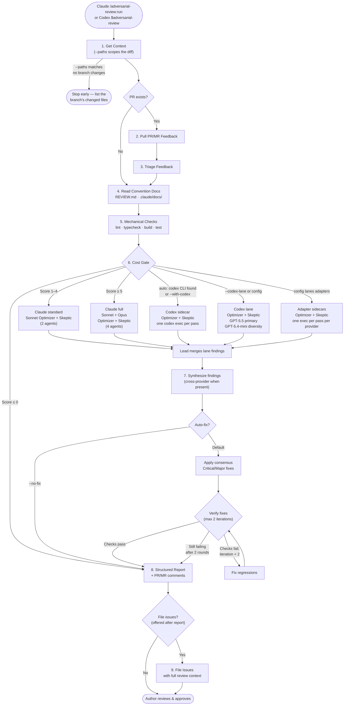

# adversarial-review


**Multi-model, adversarial code review for Claude Code and Codex.**

Free mechanical checks run first. Then two agents — **The Optimizer** and **The
Skeptic** — review your code independently and challenge each other's findings.
Only findings that survive the challenge at high confidence get auto-fixed, and a
bounded verification loop catches regressions from the fixes themselves. Add
OpenAI Codex as a cross-vendor reviewer and agreement across providers becomes
your strongest signal.

- **Adversarial by design** — every finding must survive a second, skeptical
  pass backed by command output, not reasoning alone.
- **Cost-gated** — mechanical checks are free and run first; expensive LLM review
  scales to the size and risk of the diff.
- **Cross-vendor** — Claude (Sonnet + Opus) plus optional OpenAI Codex, merged
  into one synthesis. [Learn more →](docs/cross-provider.md)

## Install

### Claude Code

```bash
/plugin marketplace add ng/adversarial-review
/plugin install adversarial-review
```

Re-run both commands to update.

### Codex

Codex support ships through `.codex-plugin/plugin.json` and the
`$adversarial-review` skill. Requires Codex CLI **v0.142.0 or newer** — earlier
versions reject the repo-root marketplace path with `local plugin source path
must not be empty` ([openai/codex#17066](https://github.com/openai/codex/issues/17066),
fixed in [#28771](https://github.com/openai/codex/pull/28771)).

```bash
codex plugin marketplace add ng/adversarial-review
codex plugin add adversarial-review@adversarial-review
```

## Usage

### Claude Code

```bash
/adversarial-review:run              # auto-fix (default), auto-detect PR
/adversarial-review:run 405          # auto-fix, specific PR
/adversarial-review:run --no-fix     # review only, no code modifications
/adversarial-review:run --no-fix 405 # review only, specific PR
/adversarial-review:run --paths "src/api/**,src/auth/**"  # review only branch changes under these paths
/adversarial-review:run --with-codex # add OpenAI Codex as a cross-vendor sidecar reviewer
/adversarial-review:run --codex-lane # run the full Codex-native review lane alongside Claude
```

### Codex

```bash
$adversarial-review                  # auto-fix (default), auto-detect PR
$adversarial-review 405              # auto-fix, specific PR
$adversarial-review --no-fix         # review only, no code modifications
$adversarial-review --paths "src/api/**,src/auth/**"  # review only branch changes under these paths
$adversarial-review --compare-claude # compare Codex findings with Claude artifacts
```

Flags combine — see [Configuration](docs/configuration.md) to set defaults once
instead of passing them every run, and [Cross-provider review](docs/cross-provider.md)
for the Codex modes.

## How it works


```mermaid
flowchart TD
    Start(["Claude /adversarial-review:run<br/>or Codex $adversarial-review"]) --> Context["1. Get Context<br/>(--paths scopes the diff)"]
    Context -->|"--paths matches<br/>no branch changes"| ScopeStop(["Stop early — list the<br/>branch's changed files"])
    Context --> PR{PR exists?}
    PR -->|Yes| Feedback["2. Pull PR/MR Feedback"]
    PR -->|No| Docs
    Feedback --> Triage["3. Triage Feedback"]
    Triage --> Docs["4. Read Convention Docs<br/>REVIEW.md · .claude/docs/"]
    Docs --> Mechanical["5. Mechanical Checks<br/>lint · typecheck · build · test"]
    Mechanical --> Gate{"6. Cost Gate"}
    Gate -->|"Score ≤ 0"| Report
    Gate -->|"Score 1–4"| Standard["Claude standard<br/>Sonnet Optimizer + Skeptic<br/>(2 agents)"]
    Gate -->|"Score ≥ 5"| Full["Claude full<br/>Sonnet + Opus<br/>Optimizer + Skeptic<br/>(4 agents)"]
    Gate -->|"auto: codex CLI found<br/>or --with-codex"| CodexSidecar["Codex sidecar<br/>Optimizer + Skeptic<br/>one codex exec per pass"]
    Gate -->|"--codex-lane or config"| CodexLaneRun["Codex lane<br/>Optimizer + Skeptic<br/>GPT-5.5 primary<br/>GPT-5.4-mini diversity"]
    Gate -->|"config lanes adapters"| AdapterLanes["Adapter sidecars<br/>Optimizer + Skeptic<br/>one exec per pass per provider"]
    Standard & Full --> ProviderMerge["Lead merges lane findings"]
    CodexSidecar & CodexLaneRun & AdapterLanes --> ProviderMerge
    ProviderMerge --> Synth["7. Synthesize findings<br/>(cross-provider when present)"]
    Synth --> ModeCheck{Auto-fix?}
    ModeCheck -->|"--no-fix"| Report
    ModeCheck -->|"Default"| Apply["Apply consensus<br/>Critical/Major fixes"]
    Apply --> Verify{"Verify fixes<br/>(max 2 iterations)"}
    Verify -->|"Checks pass"| Report
    Verify -->|"Checks fail,<br/>iteration < 2"| Fix["Fix regressions"] --> Verify
    Verify -->|"Still failing<br/>after 2 rounds"| Report
    Report["8. Structured Report<br/>+ PR/MR comments"] --> Issues{"File issues?<br/>(offered after report)"}
    Issues -->|Yes| File["9. File Issues<br/>with full review context"]
    Issues -->|No| Done
    File --> Done([Author reviews & approves])
```

1. **Parse arguments** — PR number, `--no-fix`, `--paths` scope, Codex flags, and
   config defaults from `adversarial-review.json`.
2. **Get context** — branch, diff (scoped by `--paths`), platform detection
   (GitHub/GitLab).
3. **Pull PR/MR feedback** — CodeRabbit, Copilot, and human review comments.
4. **Triage feedback** — fix now, note for the report, or dismiss.
5. **Read convention docs** — `REVIEW.md`, `.claude/docs/` review lenses.
6. **Mechanical checks (free)** — lint, typecheck, build, tests before any LLM
   spend.
7. **Adversarial review** — change-type classification and weighted escalation
   scoring pick standard (2 agents) or full (4 agents) depth, spawned in two
   waves: Optimizers first, Skeptics after the Optimizer merge lands. Claude
   reviewers run as background agents (follow along with `← for agents`, or watch
   `.reviews/<branch_safe>/`); Codex reviewers run as Codex subagents and write
   comparable artifacts.
8. **Synthesize** — confidence-based filtering and a Haiku scoring pass, then
   apply consensus fixes (auto-fix) or report them as suggestions (review-only).
9. **Structured report** — findings posted as inline PR/MR comments plus a
   persistent `summary.md`, followed by an optional issue-filing step for
   deferred, disputed, and pre-existing items.

For the wave-by-wave detail and the reasoning behind each stage, see
[Design rationale](docs/design-rationale.md).

## vs. the built-in `/code-review`

Claude Code ships a built-in `/code-review` with effort tiers and a cloud "ultra"
mode. This plugin overlaps on the basics but differs in mechanism:

- **Adversarial verification** — a second pass (The Skeptic) must independently
  confirm or refute every finding, with verdicts backed by command output rather
  than reasoning alone.
- **Consensus-gated auto-fix** — only findings that survive the Skeptic at high
  confidence are fixed, followed by a bounded verify loop (max 2 iterations).
- **GitLab support** — MR feedback, inline discussions, and issue filing via the
  GitLab API.
- **PR-feedback triage** — pulls CodeRabbit/Copilot/human comments through the
  same pipeline.
- **Issue filing** — deferred, disputed, and pre-existing findings can be filed
  as issues with the full debate context.

For a quick single-pass review of a working diff, the built-in command is cheaper
and faster.

## Severity levels

| Marker | Severity | Meaning |
|--------|----------|---------|
| 🔴 | Critical | Universal bug — fires regardless of inputs/environment. Fix before merging |
| 🟡 | Major | Significant issue, strongly recommend fixing |
| 🟢 | Minor | Worth fixing but not blocking |
| ⚪ | Nit | Stylistic or minor improvement |
| 🟣 | Pre-existing | Bug in surrounding code, not introduced by this PR |

## Review artifacts

Agent reports are saved to `.reviews/<branch_safe>/` (branch names are sanitized —
`feat/foo` becomes `feat-foo`). The `summary.md` is the artifact of record — it
captures what was fixed, disputed, deferred, and any filed issue numbers. The
review adds `.reviews/` to `.gitignore` automatically, so artifacts never land in
an auto-fix commit. Commit `summary.md` files separately if you want review
history.

## Issue filing

Issue filing is **offered after the review completes** — the plugin runs the full
review uninterrupted, then asks whether you want issues created for deferred,
disputed, and pre-existing findings. Each issue carries the full review context:
problem description, Optimizer reasoning, Skeptic challenge (with confidence
score), suggested fix, and source PR/MR reference. Works with both GitHub (`gh`)
and GitLab (API via `$GITLAB_PAT`).

## Documentation

| Doc | What's inside |
|-----|---------------|
| [Configuration & customization](docs/configuration.md) | `REVIEW.md`, flag defaults, scoped reviews, adding providers |
| [Cross-provider review](docs/cross-provider.md) | Codex sidecar vs. native lane, how lanes merge into one synthesis |
| [GitHub Actions & CI](docs/github-actions.md) | Claude and Codex workflows, inputs, fork-PR safety, release automation |
| [Design rationale](docs/design-rationale.md) | Research foundations, patterns from Claude Code internals, known limitations |
| [Cross-provider protocol](docs/review-protocol.md) | The normative spec: artifact contract, schemas, adapter registry |

## Plugin layout

Claude Code and Codex use separate skill trees so each runtime only loads
instructions written for its own orchestration model:

| Runtime | Manifest | Skills |
|---------|----------|--------|
| Claude Code | `.claude-plugin/plugin.json` | `claude/skills/` |
| Codex | `.codex-plugin/plugin.json` | `skills/` |

What the two trees share — the artifact contract, finding/verdict schemas,
severity and signal-gate definitions, lane preamble template, and provider
adapter registry — is normatively specified in
[`docs/review-protocol.md`](docs/review-protocol.md). The skill files embed
copies where subagent prompts need them inline; when changing a shared
definition, edit the protocol doc first, then sync the embedded copies.

## Changelog

See [CHANGELOG.md](CHANGELOG.md) for release history.

## License

MIT
