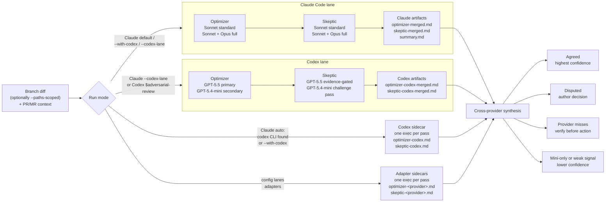

# Cross-provider review

An all-Claude reviewer pool (Sonnet + Opus) shares blind spots. Adding OpenAI
Codex — a different vendor, different training, different failure modes — turns
agreement into signal:

- A finding **both vendors** independently flag is almost certainly real.
- A finding **only Codex** raises is blind-spot coverage one vendor can't give
  you.

The interop layer between providers is deliberately **files, not APIs**: every
lane writes comparable `.reviews/<branch_safe>/` artifacts, and synthesis reads
those files. The contract is specified in
[`review-protocol.md`](review-protocol.md); any provider whose CLI can follow a
prompt and write markdown can join. See
[Adding more providers](configuration.md#adding-more-providers-lanes).

## The three ways Codex can join

| Mode | How it runs | Cost | When to use |
|------|-------------|------|-------------|
| **Sidecar** (`--with-codex`) | One background `codex exec` per pass, using the Claude prompts adapted for Codex | Cheap | The default when Codex is available |
| **Native lane** (`--codex-lane`) | The full Codex-native workflow, orchestrating its own subagents | Higher | You want maximum cross-vendor depth |
| **Separate lane** (`$adversarial-review --compare-claude`) | Codex runs standalone, then compares against Claude artifacts | — | Codex-first workflows |

### Sidecar — `--with-codex`

One background `codex exec` call per pass, using the Claude review prompts
adapted for Codex. It writes the same report files the merge step reads
(`optimizer-codex.md`, `skeptic-codex.md`), so it's a first-class reviewer. It
runs in a `read-only` sandbox, which **structurally enforces** the report-only
constraint.

### Native lane — `--codex-lane`

Each pass is delegated to the Codex-native workflow in
[`../skills/codex-review/SKILL.md`](../skills/codex-review/SKILL.md) — the same
lane `$adversarial-review` runs inside Codex. Codex orchestrates its own
subagents (GPT-5.5 primary + GPT-5.4-mini diversity at full depth) with its own
prompts and trust model, and writes merged lane artifacts
(`optimizer-codex-merged.md`, `skeptic-codex-merged.md`) that feed the same
cross-provider synthesis. The lane's Skeptic phase reads the Claude lane's
`optimizer-merged.md` as `--compare-claude` input, so every Claude finding gets a
genuinely cross-vendor challenge.

Containment: the lane needs a `workspace-write` sandbox to write its artifacts,
so it falls back to a prompt contract, a gitignored `.reviews/`, and a
baseline-aware tracked-file guard — a pre-phase snapshot, then a revert of only
what the lane newly dirtied. Pre-existing uncommitted work is never touched.

## The sidecar is the default when available

If the [`codex` CLI](https://github.com/openai/codex) is installed and
authenticated via `codex login` (ChatGPT SSO — no API key needed), a Claude run
adds the sidecar automatically. No flag needed.

The native lane stays opt-in because it costs meaningfully more. If Codex is
unavailable the review proceeds Claude-only with a note — **Codex can only add
coverage, never block a review**. This is local-CLI only for now; the GitHub
Action runs Claude-only.

To change your default without passing flags every run, set it once in
`~/.claude/adversarial-review.json` (user-wide) or
`.claude/adversarial-review.json` (per repo):

```json
{ "codex-lane": true }
```

to default the full lane on, or `{ "with-codex": false }` to opt out of the
auto-detected sidecar. Explicit flags always win — `--no-codex` forces a
Claude-only run; `--with-codex` / `--codex-lane` force Codex on. See
[Configuration](configuration.md#flag-defaults) for the full reference.

## How lanes flow into one synthesis



## Running Codex on its own

```bash
$adversarial-review                  # auto-fix (default), auto-detect PR
$adversarial-review 405              # auto-fix, specific PR
$adversarial-review --no-fix         # review only, no code modifications
$adversarial-review --paths "src/api/**,src/auth/**"  # scope to matching branch changes
$adversarial-review --compare-claude # compare Codex findings with Claude artifacts
```

Codex is **not** a literal `model: "codex"` drop-in for the Claude Code `Agent`
tool. For cross-provider review from a Claude run, pass `--with-codex` (Codex
joins as a read-only `codex exec` sidecar) or `--codex-lane` (the Claude run
drives the full Codex-native lane headlessly, subagents and all); either way the
Codex reports merge into the same synthesis. Alternatively, run Claude and Codex
as fully separate reviewer lanes that write comparable `.reviews/<branch_safe>/`
artifacts, then synthesize agreement and disagreement.

For CI, see [GitHub Actions](github-actions.md).
