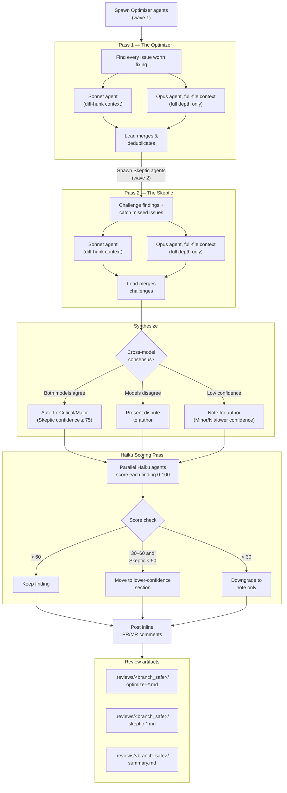

# Design rationale

This plugin's architecture is informed by research on LLM code review and by
first-principles patterns from Claude Code's own agent orchestration internals.
This doc explains *why* the pipeline is shaped the way it is.

## The adversarial pass, in detail

The core of the pipeline is two waves of reviewers followed by a synthesis that
only trusts findings that survive scrutiny.

## Research foundations

**LLMs cannot reliably self-correct through reasoning alone**
([Huang et al., 2023](https://arxiv.org/abs/2310.01798)). Forced self-correction
can degrade quality — LLMs flip correct answers to incorrect at rates similar to
actually fixing errors. We mitigate this three ways: (1) different models across
agents (Sonnet + Opus have different blind spots), (2) the Skeptic is never
forced to disagree — it only challenges findings where it has a substantive
objection, and (3) the Skeptic validates with external tools (tests, linters,
type checkers) rather than pure reasoning.

**LLM static analysis can be hijacked via naming bias**
([Bernstein et al., 2025](https://arxiv.org/abs/2508.17361)). Misleading function
names, comments, or docstrings can cause reviewers to overlook vulnerabilities.
The Optimizer includes an explicit "deception detection" lens that checks whether
names and comments match actual behavior. Multi-model diversity is a second layer
— different models respond differently to deceptive patterns.

**LLM code analysis is vulnerable to adversarial triggers**
([Jenko et al., 2024](https://arxiv.org/abs/2408.02509)). Subtle code patterns can
manipulate LLM behavior in black-box settings. Running four independent agents
(2 models × 2 roles) with cross-model consensus makes it harder for a single
adversarial trigger to fool the entire pipeline.

**Progressive cost-gating and verification loops** are inspired by
[Ouroboros](https://github.com/Q00/ouroboros)'s three-stage evaluation pipeline:
run free mechanical checks first, escalate to expensive LLM review only when
needed, and use bounded iterative verification (max 2 rounds) to catch
regressions without risking infinite fix-break cycles.

## Learned from Claude Code internals

Several patterns were directly informed by studying Claude Code's own agent
architecture, via the
[March 2026 source map disclosure](https://github.com/anthropics/claude-code/issues/1956).

**Anti-rationalization guards** — Claude Code's built-in verification agent
explicitly lists its own failure modes in its prompt: "You have two documented
failure patterns. First, verification avoidance... Second, being seduced by the
first 80%." It also enumerates rationalizations that don't count as validation
("The code looks correct based on my reading"). We adopted this for The Skeptic —
naming rubber-stamping and lazy disagreement as failure modes and calling out
weak verdict bases. The framing is deliberately measured rather than
all-caps-MUST-heavy: current Claude models follow instructions literally, and
aggressive protocol language written for older, laxer models over-triggers on
them.

**Evidence-gated verdicts** — Claude Code's verification agent requires a
`Command run` block with actual output for every PASS verdict ("A check without a
Command run block is not a PASS"). We applied this as the `Evidence` field in
Skeptic verdicts, tiered by stakes: command-output evidence is mandatory for
verdicts on Critical/Major findings; Minor/Nit and inherently non-tool-verifiable
findings (architecture, naming) accept reasoned verdicts with confidence capped
at 50. The tiering keeps the forcing function where it matters, avoids wasted
tool runs on findings that are never auto-fixed, and avoids systematically
burying non-mechanical findings.

**Change-type strategy matrices** — Claude Code's verification agent uses
different strategies depending on change type (frontend, backend, CLI, infra,
library, bug fix, DB migrations, refactoring). We adopted this as the change-type
classification step: every changed file maps to a type (auth, database, crypto,
api, frontend, infra, etc.) with type-specific priority checks. An auth change
gets privilege-escalation and IDOR checks; a database change gets
migration-reversibility and N+1 checks; a frontend change gets ARIA and
keyboard-nav checks.

**Coordinator-only synthesis** — Claude Code's Coordinator Mode restricts the
coordinator to just 4 tools (Agent, TaskStop, SendMessage, SyntheticOutput) while
workers get the full toolset, preventing the coordinator from accidentally
modifying files during synthesis. We adopted this as explicit read-only
constraints during synthesis: the lead can only read reports and write to
`.reviews/`, with source modifications confined to the explicit "Apply agreed
fixes" sub-step.

**Numeric output anchors** — Claude Code's internal prompts use specific
word-count limits ("Keep text between tool calls to ≤25 words"), which showed
measurable token reduction in A/B testing. We applied this to both agent prompts:
Optimizer findings ≤50 words per Problem field, suggested fixes ≤30 words,
Skeptic challenges ≤50 words. This trims verbose reasoning that inflates cost
without improving signal.

**Signal gate** — Adapted from
[OpenAI Codex's review guidelines](https://github.com/openai/codex/blob/main/codex-rs/core/review_prompt.md).
Every Optimizer finding is assessed against an 8-point checklist: actionable,
introduced by the PR, not demanding rigor absent from the rest of the codebase,
not relying on unstated assumptions, provably identifying the affected code path.
Originally this was a suppression filter ("drop silently if any check fails");
it's now recorded as per-finding metadata (a `Gate` field plus a 0–100
confidence) because current Claude models follow drop-silently instructions
literally — they find real bugs and then decline to report them, killing recall.
Filtering instead happens downstream, where the pipeline already has the
machinery: the Skeptic challenge, confidence thresholds, and the Haiku scoring
pass. The Codex prompt also informed our tightened Critical severity definition
(universal issues only, no scenario-dependent triggers), the mandatory Trigger
field in findings (forcing reviewers to specify when a bug manifests), and the
matter-of-fact tone guidance for PR comments.

**Fix quality anti-patterns** — Claude Code's system prompt explicitly tells the
model "Three similar lines of code is better than a premature abstraction" and
"Don't add features, refactor code, or make 'improvements' beyond what was
asked." We added these as Fix Quality Guardrails in the Optimizer prompt —
preventing suggested fixes from over-engineering with unnecessary abstractions,
feature flags, or adjacent refactoring.

## Known limitations

- A determined attacker who understands the specific models, prompts, and
  consensus logic could craft code that fools all four agents simultaneously.
  This is a defense-in-depth layer, not a security boundary.
- A Claude run on a machine without the `codex` CLI uses only Claude models —
  "multi-model" there means Sonnet + Opus, which is within-family diversity, not
  multi-vendor diversity. For cross-vendor review, install and authenticate the
  `codex` CLI (the sidecar then joins automatically), pass `--codex-lane` for the
  full Codex-native lane, or run `$adversarial-review --compare-claude` against
  the Claude artifacts and treat provider disagreement as a first-class review
  outcome.
- The Skeptic's self-correction is bounded but not eliminated — it can still flip
  correct Optimizer findings to incorrect (Huang et al.). Multi-model diversity
  reduces but does not remove this risk.
- Deception detection relies on the LLM's ability to reason about naming vs
  behavior, which is itself susceptible to sophisticated adversarial patterns
  (Bernstein et al.).
- Weighted escalation scoring improves on coarse heuristics but remains an
  approximation — some high-risk patterns in low-scoring diffs may still get
  standard depth. Projects can fine-tune via `.claude/docs/code-review.md`
  critical lenses.
- Human review remains essential for high-risk changes.
